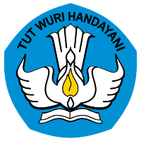
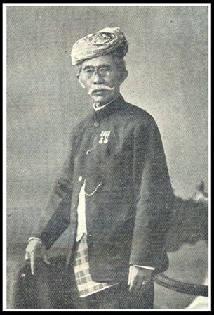
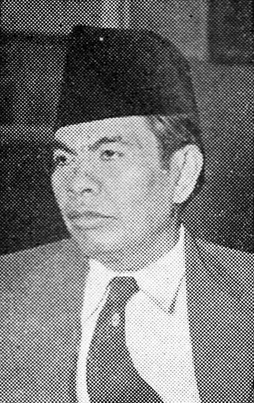

<h1 style="text-align:center">PRAKATA</h1>

<figure class="label outside bottom" data-label="logo Kemdikbud" style="width:10em;float:left;margin:0.5em 1em 1em 0em;font-size:0.65em !important;"></figure>
Penyempurnaan terhadap ejaan bahasa Indonesia telah dilakukan oleh Badan Pengembangan dan Pembinaan Bahasa, Kementerian Pendidikan dan Kebudayaan. Penyempurnaan tersebut menghasilkan naskah yang pada tahun 2015 telah ditetapkan menjadi Peraturan Kementerian Pendidikan dan Kebudayaan Nomor 50 Tahun 2015 tentang Pedoman Umum Ejaan Bahasa Indonesia.

<figure class="label outside bottom" data-label="Engku Nawawi gelar Soetan Ma'moer" style="width:10em;float: right;margin:0.5em 0em 1em 1em;font-size:0.65em !important;"></figure>
Ditinjau dari sejarah penyusunannya, sejak peraturan ejaan bahasa Melayu dengan huruf Latin ditetapkan pada tahun 1901 berdasarkan rancangan Ch. A. van Ophuijsen dengan bantuan Engku Nawawi gelar Soetan Ma'moer dan Moehammad Taib Soetan Ibrahim, telah dilakukan penyempurnaan ejaan dalam berbagai nama dan bentuk.

Pada tahun 1938, pada Kongres Bahasa Indonesia yang pertama di Solo, disarankan agar ejaan Indonesia lebih banyak diinter-nasionalkan. Pada tahun 1947 Soewandi, Menteri Pengajaran, Pendidikan, dan Kebudayaan pada masa itu, menetapkan dalam surat keputusannya tanggal 19 Maret 1947, No. 264/Bhg.A bahwa perubahan ejaan bahasa Indonesia dengan maksud membuat ejaan yang berlaku menjadi lebih sederhana. Ejaan baru itu oleh masyarakat diberi julukan _Ejaan Republik_.

<figure class="label outside bottom" data-label="Menteri Moehammad Yamin" style="width:8em;float:left;margin:0.5em 1em 1em 0em;font-size:0.65em !important;"></figure>
Kongres Bahasa Indonesia Kedua, yang diprakarsai Menteri Moehammad Yamin, diselenggarakan di Medan pada tahun 1954. Kongres itu mengambil keputusan supaya ada badan yang menyusun peraturan ejaan yang praktis bagi bahasa Indonesia. Panitia yang dimaksud yang dibentuk oleh Menteri Pengajaran, Pendidikan dan Kebudayaan dengan surat keputusannya tanggal 19 Juli 1956, No. 44876/S, berhasil merumuskan patokan-patokan baru pada tahun 1957.

Sesuai dengan laju pembangunan nasional, Lembaga Bahasa dan Kesusastraan yang pada tahun 1968 menjadi Lembaga Bahasa Nasional, kemudian pada tahun 1975 menjadi Pusat Pembinaan dan Pengembangan Bahasa, menyusun program pembakuan bahasa Indonesia secara menyeluruh. Di dalam hubungan ini, Panitia Ejaan Bahasa Indonesia Departemen Pendidikan dan Kebudayaan yang disahkan oleh Menteri Pendidikan dan Kebudayaan, Sarino Pedoman Umum Ejaan Bahasa Indonesia Mangunpranoto, sejak tahun 1966 dalam surat keputusannya tanggal 19 September 1967, No. 062/1967, menyusun konsep yang di-tanggapi dan dikaji oleh kalangan luas di seluruh tanah air selama beberapa tahun.

Setelah rancangan itu akhirnya dilengkapi di dalam Seminar Bahasa Indonesia di Puncak pada tahun 1972 dan diperkenalkan secara luas oleh sebuah panitia yang ditetapkan dengan surat keputusan Menteri Pendidikan dan Kebudayaan tanggal 20 Mei 1972, No. 03/A.I/72, pada hari Proklamasi Kemerdekaan tahun itu juga dires-mikanlah aturan ejaan yang baru itu berdasarkan keputusan Presiden, No. 57, tahun 1972, dengan nama _Ejaan yang Disempurnakan_. Departemen Pendidikan dan Kebudayaan menyebarkan buku kecil yang berjudul _Pedoman Ejaan Bahasa Indonesia yang Disempurnakan_, sebagai patokan pemakaian ejaan itu.

Karena penuntun itu perlu dilengkapi, Panitia Pengembangan Bahasa Indonesia, Departemen Pendidikan dan Kebudayaan yang dibentuk oleh Menteri Pendidikan dan Kebudayaan dengan surat keputusannya tanggal 12 Oktober 1972, No. 156/P/1972 menyusun buku _Pedoman Umum_ yang berisi pemaparan kaidah ejaan yang lebih luas.

<figure class="label outside bottom" data-label="Dr. Anis Baswedan" style="width:10em;float:left;margin:0.5em 1em 1em 0em;font-size:0.65em !important;"></figure>
Pada tahun 1988 _Pedoman Umum Ejaan yang Disempurnakan_ (PUEYD) edisi kedua diterbitkan berdasarkan Keputusan Menteri Pendidikan dan Kebudayaan Republik Indonesia Nomor 0543a/U/1987 pada tanggal 9 September 1987. Setelah itu, edisi ketiga diterbitkan pada tahun 2009 berdasarkan Peraturan Menteri Pendidikan Nasional Nomor 46. Pada tahun 2016 berdasarkan Keputusan Menteri Pendidikan dan Kebudayaan, Dr. Anis Baswedan, _Pedoman Umum Ejaan Bahasa Indonesia yang Disempurnakan_ (PUEYD) diganti dengan nama _Pedoman Umum Ejaan Bahasa Indonesia_ yang penyempurnaan naskahnya disusun oleh Pusat Pengembangan dan Pelindungan, Badan Pengembangan dan Pembinaan Bahasa.

Penyusunan pedoman ini tidak terlepas dari kerja keras dan kontribusi berbagai pihak. Oleh karena itu, penghargaan dan ucapan terima kasih kami sampaikan kepada segenap pakar dan ahli bahasa, pengambil kebijakan di tingkat kementerian, serta kalangan masyarakat yang telah bekerja sama mewujudkan tersusunnya _Pedoman Umum Ejaan Bahasa Indonesia_.

Jakarta, Maret 2016

Pengembang Pedoman Bahasa Indonesia  
Badan Pengembangan dan Pembinaan Bahasa  
Kementerian Pendidikan dan Kebudayaan

